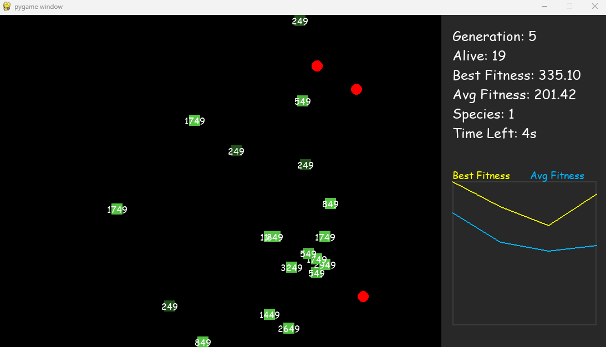

# 신경망 프로젝트

## 환경 설정
```bash
conda env export --from-history > environment.yml
```

## 복구
```bash
conda env create -f environment.yml
```


### 1. 빨간색 먹이를 먹게 진화(11/23)


### 2. 먹이의 개수를 3개로 늘리고, 터미널에서 나오는 콘솔을 화면에 올리고, 그에 대한 그래프 작성 5~6 (11/26)

